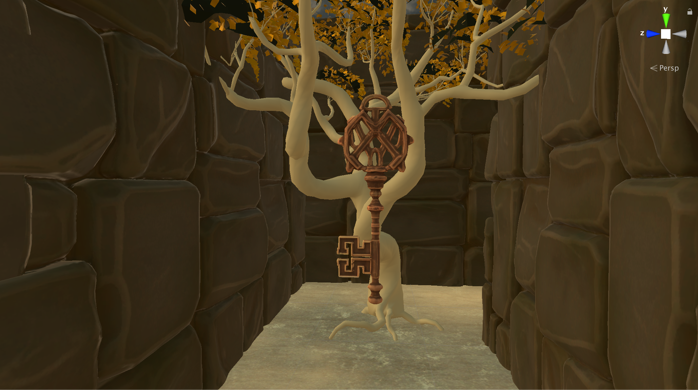
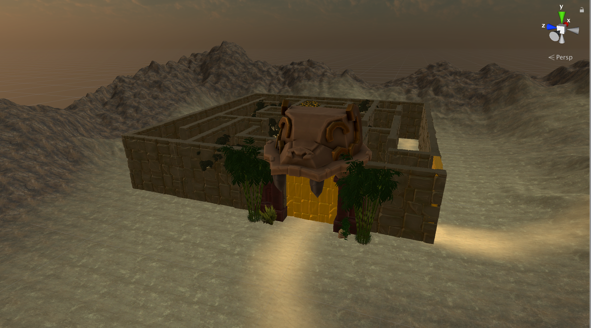
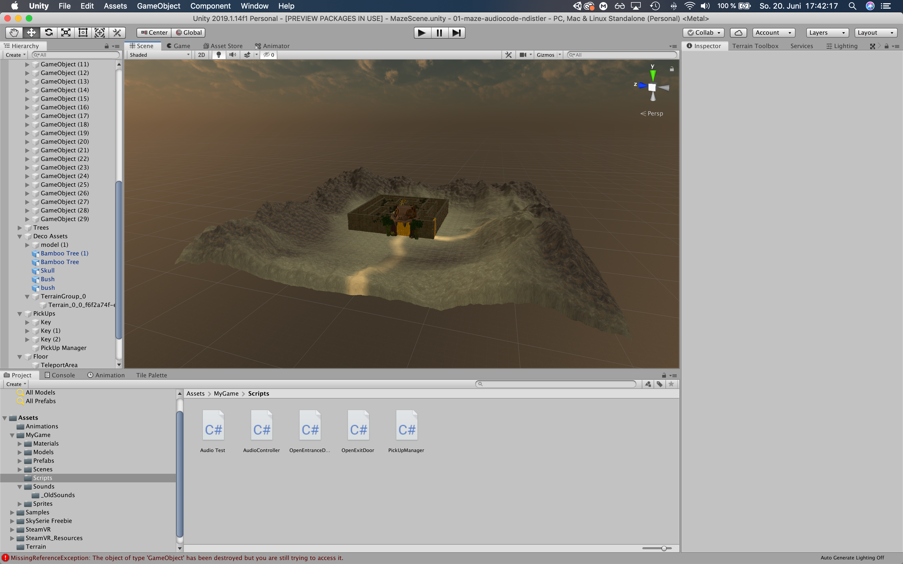

# 01-maze-audiocode-smeerws

## Project description: 
VR Game in Unity, Schulprojekt, 4AHMNM. Dabei geht es um einen Irrgarten in welchem man 3 Artefakte finden muss um dem Jungle Labyrinth zu entfliehen.

## Concept:
Man befindet sich vor einem Irrgarten in einem verlassenem Azteken-Dschungel. Aufgabe ist es, 3 Artefakte zu finden und diese zu einem vertrockneten Baum zu bringen, damit dieser wieder aufblühen und zum Leben erwecken kann. Dadurch erhält man einen Schlüssel, mit dem man die Ausgangstür zum Irrgarten öffnen und somit verlassen darf.

#### Spielablauf
Startpunkt ist vor dem Eingang des Irrgartens. Man kann einen mystischen, leicht traurigen Sound von einem der nahegelegenen Bäume im Labyrinth wahrnehmen. Folgt man diesem Sound, springt er von einem zum anderen Baum und führt einen schließlich zu einem vertrockneten, großen Baum, inmitten des Irrgartens. 
Dort erhält man die Anweisung, im Dschungel 3 Artefakte zu suchen, welche dem Baum helfen sollen, wieder aufzublühen.
Die Artefakte findet man anhand von mystischem, glänzendem Sound, der von ihnen ausgestrahlt wird. Ist man in der Nähe eines Artefakt, sieht man es schön im Sonnenlicht glänzen. Bevor man es jedoch entnehmen kann, muss man es vorher noch freilagen, da es verwachsen ist.
Hat man alle 3 Artefakte gefunden, führt einen der Sound des Baumes wieder zu ihm. Nun muss man die 3 Artefakte ablegen und der Baum beginnt aufzublühen. Sobald er wieder zu einem prächtigen Baum gewachsen ist, erhält man einen Schlüssel, mit dem man zum Ende des Irrgartens gelangt und wieder hinaustreten kann.

#### Skizze & Screenshots

    
    
    

 

#### Sounds
Tree Sound, Mono, Loop
Main Tree Sound, Mono, Loop
Artefact Sound, Mono, Loop
Jungle Ambience Sound, Stereo, Loop
Footsteps, Stereo,  One Shot
Wood Pickup Sound, Mono, One Shot
Artefact Pickup Sound, Mono, One Shot

#### Collectibles und Interaktionen
Die Collectibles wären die Artefakte. 
Die Interaktion ergibt sich in dem man die Artefakte freilegt, aufpickt und sie zum Main Tree bringt und vor diesen hinlegt.
Eine weitere Interaktion wäre das Schlüssel-drehen am Ende des Spiels, um den Irrgarten verlassen zu können. 

#### Development Platform: 
OS: Mac OS Mojave, Game Engine: Unity 2019.1.14f1, Visual Studio 2019, Steam, SteamVR 2.5.0 (https://github.com/ValveSoftware/steamvr_unity_plugin/releases/tag/2.5.0)

Note on Unity Version 2019.1.14f1 and SteamVR: The SteamVr plugin has many issues when used with Unity Versions > 2019.1.3 because the XR Management System changed from 2019.1.3 to 2019.1.4. Valve is working on it, so we will use these older versions for the VR programming.
Download steamvr_2_5_08_19.unitypackage, import the package: Assets --> Import Package --> Custome Package

#### Target platform: 
Oculus Rift/S, Vive; 
Tested on Oculus Rift S

#### Visuals: 
Screenshots (concept and experience), Video

## Third party material: 
All assets have been downloaded from sketchfab and can be seen in my "Maze Collection" 
https://sketchfab.com/andyfromouterspace/collections/maze

## Project state: 
100%/100% finished
<progress max="100" value="100"></progress>

## Limitations: 
- My Mac wouldn't let me record with stereo built-in audio

## Lessons Learned: 
I don't really like coding:)

Copyright by ndistler
